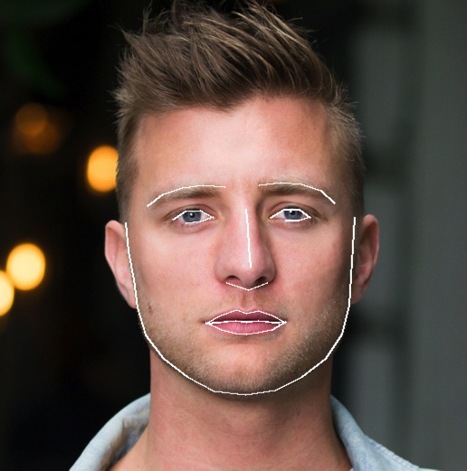
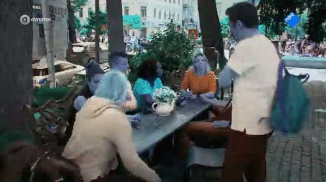
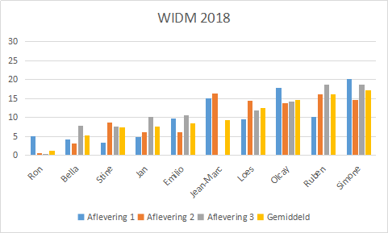
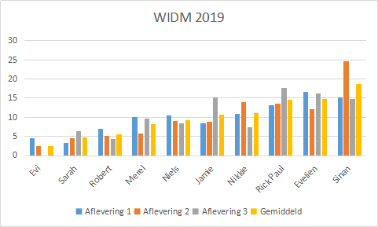

### WIDM 2022

Succes allemaal met raden! 

[Grafiek stats aflevering 1, 2 & 3 seizoen 2022](https://vega.github.io/editor/#/url/vega-lite/N4IgJAzgxgFgpgWwIYgFwhgF0wBwqgegIDc4BzJAOjIEtMYBXAI0poHsDp5kTykBaADZ04JACyUAjAHZKABkoArCGwB2IADQgoagGY0yaUMRpwA7ke1rMNVQzYMIACTgGsaAMxy5Wnapt2DhAA6jQAJvRoYt4AvjFaYUiYKKigqkgIcGggicn8utJiSB4ArHBMTACcugBsNdKVNboATEglzSUlumIecHAeSOUg8TlJSBBwmBCWuQIFRaXlVbX1jS1tHV09fQNDqADaoACkAATEbGwATgDWbJnqqJKUlZXeYpXSJZLNPdIAHJJJFo4DgaCowll0EhdII4KRLrYyCdJJoQDg4JcVGpskhLqo2MMNMczhcbnc4A9JAo5M1JB5aY1JDVmnIxDVKsDQeDISBobD4Yjkaj0ZiLg8QHCMdj4sTzldbvc0FSpDUPGy-h5pD9mqVGpywWwITiYZKEaokSitCKseLdJc4BAaCgZSBTnKyYrUH9KO0-v82WIAX7VR59dzjfyMYLLWiMTbsmRYeoXW7SQqKUrZGJvpVSvSPB4NXI-iUw4aeXzTdHhXGxdkYDRBM6ia6SfLyZSnpqZN8-jUxB05DI-mWjVCTQLzUKrbXsehrjQEEIncmW6n257vYW6oWddJC2ISnIaqOKxOo1OY9a6+gm5M6E7CbK0x2lU8tdI5P8-pVviUGnqEpcuWEZVpeNainOIAQEgDaCE+rbuumDyyMOHi5oUnT-pUPylkBBpjry55mhaEHxugEAMAAXkgqiqFkKZth6GZes8nTNDqfx-HIJQfEOYinqBk6kTOkHivQdzjAh67MQ8EjNP26E6j8ci5gC0iCeOkYkdOsZidkZhwIICBsHAYTSUxyFoM08i-h0YifM0JY9kC+HhlpYFIs0ZE3ryeIEoxSGvo8NmHj80iSIGTk-vuoZuSBHnCSc3mieRErwtKa6WcFgKUNENR-GI2bHmyhYNJpRHaYKKV6WldoOo+gUvp63yUApOr-tmRWBnUHLxYRlZJTV15QYmGZNRuLGRW1JQlp0dJeA0hUaf1Z5VVOw2zuKcHNs+k1yXl9QFcexYeDUR6SH1IIEWtnnJT5UELkuwi0RZQWepU8heNmfyDpUR7-hVg0Xl5D3ineNg2LtiHNVNsiNP+DRstIx01K513uZVd2bfpFGwY2b2ww8Ch1CU6E4ehJS-O1QPEdVYPZJRNF0QxWXvVNCgaudQ6vIC+WFbT62g6lvkScg0wTbJUQ+sy+4owOs1YejwEDXTG0M+ghnGaZ5mS1ZqAeJQBasn2KNqkerJxRjCVY0lHga35+KE-tSolG1fbFjS+7NJ+n4jqtQkgyc9si1BpqZXtUuPG73YOfu7Io5UPSC3dIe1b59WOtDMn6woaqSLNGoli8gYo80Kd2w7Y2rpH+uSN6PvvP83NarN-wV0HacjdtjbZ9lnoSEVJW8w0BboR3Old1t2RPcur16zlhu-h8ClajhdmshPgpT7jIAQw+ffsw83oRTxcgHk57JquXAeJZ3DswXBztRwoMhfknl3NC8hSFsrN2B5PB+1FaL0WfnXJ4foeb9gWgyByW8pw7zSmLKSC9Nzu1KPXM659PiFBPLfW299Q7ii1iZMywwAC6IwKQ6DCIiSwOhBBXEsPoIy5l0DWyNFoTAABPdE2R8QIFsEgeCIwGEMAQA8UALDBBsPTtiLQKhLiYDQPsR2BIFHAJZqiEhOtUSzxeuoLQ1dUT7yhqiZB0wtCZ0fMCDKhjoL43gloHaIByFcLoLCbI5jeE8gEUIkRXCLiCBsDgFRUjTAyOyN3bxfD0B+PSAE8JrDsgcKyFwnx-C7j+IQtI2ROdXxWKuMgZR6ApC6BiTyAAjgwWikMkg0FIBQrQAAPZhETZGpPMR4nkFTMmCISYSEA3C2nJPQPkxU6TYkgGqbUug9TGlxC0MgG42QmC4i6ZgTxBwQDBAAJIABEACyyUaQ1QAOIOiuJgPolwwgnDYDgE4ZBEDhAhDI-uFJ7nwhOEwVwEITjAxIhmNxIAzDhEiKgaIMQgA/view)

Voorspelling 2022: op basis van deze berekende stats is Kim-lian de mol.

### WIDM 2021

Trek vooral je eigen conclusies!

[Grafiek stats aflevering 1, 2 & 3 seizoen 2021](https://vega.github.io/editor/#/url/vega-lite/N4IgJAzgxgFgpgWwIYgFwhgF0wBwqgegIDc4BzJAOjIEtMYBXAI0poHsDp5kTykBaADZ04JACyUAHJQCMlAFYQ2AOxAAaEFBUAzGmTShiNOAHcDmlZhrKGbBhAAScPVjQBmAAweNW5VZt2EADqNAAm9GhiXgC+0RqhSJgoqKDKSAhwaCAJSfxiAKwAbIX52jIATACccJLalaFFklCS5Uit5flIHlAycIWZcdmJSBBwmBDmOQIFxaUV1bX1jc3tbZ3dvf1oANqgAKQABMRsbABOANZsGaqoMvmUAOwtYpVuboWSD17lxRpwODQlKFMugkNpBHBSKdrGQDjJ1CAcHBTkoVFlYEhToI2NgBmp9kcThcrnAbm5KG58pVJPkaW5yuUHuV6fk-gCgSCQGCIVCYXCEUiUScbiBkTRziA4gTjmdLtc0DIPBTJJUPO8OjJFflyjIHmzAWxgVluZCxcpYfCNILUSLwWdSVZ5KopSBDjLifLUBI7kUZAUvGIxOUPJ99RzjeDTdDzfyrcibVl5GwIIwUC63US5aSFfcZIVKUyPIUPBU3E8xGHDZyTbyY5bEfHhVlBEhzimEDRJfjXYTZSSbpVKB885UHoUKg96R5KoVK0bQZHaxaBY20ehkND5HjpZn+2gHpQqoGql8WgzJBU59XF2bl3GhWuQKdEFouzu+56JPlp+VJG4LzOv6FGIeqiuyVYRjyt6xg2D4is+yhwNuPbulmNx+pQtKSDSlRiHmgZFOUFZgQa85cje0Z3rBCboKcbBQOcACeb4obunp3JQHgPPkdwgZ49IPH6s4keGC5QZRMHWk26AQDgwh+MiLEZh+2aoIORRTm4uqFF8eGgf8pHXuJfLlCucHojAmLYriSm9h6qkSH+pbcaqlRuW8khXpBUYmWZNGitCErpnZaEKnIeGFL+RYhpIHxuF5Yk+TGpn3v5doIY6zrdsp9k3AeWn8Q8TJvJFJblAl5HGclfnSSASYpgwabZSFe63NIeY6WOM7YbhRXxSJEGJUuBwpdRtUtm2MAdrZqGtYUh6fAyXwltS+SBjIFU1tBo1SY+G40FuM1sapSrvG4bmTtqDxiCUHSsgNZFbRJO2rvBL5sEdKk3BIN1MlEzItNqF4dJtFG+altUIUhn25Qqg6VPk7yTkWeEIyq+ngY9YPVRDj50QxzHBbN7EHvmk4-Iy52qpOxEGaJlVJbCL3mTJcnWJgilE8d6ESO8iollp3HMh4+QY4Z3nDW4NWPhiWI4hzMOhagSqRbSzIFDIlSKlEki05jRmMwcUu4yKYpBc1xOqXmUijsyU53BeHiMqDVWwsbY2PulDoHVl76w16lC4Vxmo3UR35Uv1dODQzkvSyK9WporrWapQQYIxUPHAYUqrnS7hvu7tIoTe2nZc19aD3CqVJ3DpNJEWWevi0N0EF69WT7YdZf+0qPyUh4N2am8RbUpH+sSy3cdZM+CCvl3Svzbh7l4QDIF5p5D0G7HJtT6S0Nz61OpSKeLTXf3IEI2L9NPXyrcs0+9FMUn7HzWOa2SCGCNa40edbx7IqyfJDmpxJQAF1Biki0KEGE5gtDYmASkEAug4CCFCFkKORoNCYEYkiLIygrjWCQIILsFhBAMAQDcUASCUFZELgiJQpxMA7CfO9BEZsERQ0yBoBOjUEQd04YguB3snQIlltZBWGhi5TU7BoAB7NFIaHxo-EBmC6AQiyAiLBOD0B4I7GkIhgxMAnEEFYHAOxKHGGoegWhmDsGch0QQ-R3YqGoPQOg-hmi7H4L0SxZxWQcqhQ0NoM4yBGHoFkNoDRtisgAEdGp+DoIkGgpBQEaAAB7mF8a4seKjMBqPQJErRIB7HeMGMxBBmTWLlxsYU2JSB4lJCsMk2IGgNwSnQEwTEGjVEgm2CAIIABJAAIgAWRGk7esABxOA9CObIlCAcNgOADhkEQGEYEKCWrXAWVCA4TBnDAgONfc02ZlEgBMGECIXoPDRCAA/view)

Voorspelling 2021: op basis van deze berekende stats is Renee, Joshua of Marije de mol.

* * * 

### WIDM 2020 SE

[Grafiek stats aflevering 1, 2 & 3 seizoen 2020 special edition](https://vega.github.io/editor/#/url/vega-lite/N4Igxg9gdgZglgcxALlANzgUwO4tJKAFzigFcJSBnAdTgBNCALFAFgAY2AacaYsiygAlMiRoRQBmDgF9p3OgENCCvCCgKAtphQhFygLQwFdABwsAnAEYwAdgBMCgKyZL1y47oA2GGA8AjTBY-GD86PxA5EA0FACcAax0-WJBuTChIOhIkVB4AGwgY1UIATwAHbWQ1CA0SBVyUkHhMXLodTFK4Sgg6bUjIXNINKCKyiqqa9XruJpadcpiu6AaumPFkAG0QPhVudToAKx2QfcwYiDSG0qUYuDAE7jPh7nKEBGKGkoQIBqg4OLisA1mrl3txGAUFGBtABdbjEQi5MYROEQCC5YilFDrUAlco6KDVWpTRpYWaVeaLYZyHGjfGEyYNGatSrtTrdXqcGl4yoAR1ICiIcGUxDQ2mmpOZIAApAACNCo+LVC7TArRNYgAB0lhgEVhIAAHiNueMiYyJW0Ol0eh8hYidMiQO8crixnyBfClHBRWbmpLZfKCnElVTIvC7RsQNQAJIAEQAsjK7GwkzKAMoAUQaAHFMCtCJhTnQZRBSjKEJganQei05Qqg1ooMXRTEZQF6JgZQoYIjm1kLnrsPQmKwuCAACSUMCMCsqSpiQilSjIAD0y9FCAUGoQQsYpD8GrgEGXk+n0TXmA3+lyQswa5YGpMWo1+y6T10SgUlEwhEoqj0CkMYwzCsWwHGcVwwHcLwfH8QJglCcINlAClUWGFlchBIFLXZHQux7U4shlSwGn9OtgxQSw2A1OxzDsExLDsGwmLolgTDsTxqRAFCljnCEoSwtlrUqPDMF7KAECIkja0DcjkEsR87AkFg7EcZM7HkxiTA4zkuNOSkdBOM5lRAVkrTGESxIk4juFImSGxQGxqJsRxzEcCQTBckw2BYGwrE47i0LUYxDgEszcO7USCPEySbOkxV7OQTwNUcTxPEonzk2cthUscfy9NQ-E-gBMUTOwoSQAsqKrKkgN4ouOTLA1bybEy1SctYiRcp0gK5muW57lKwTzIiyyYulOL63qyitXcTrvJMLz1Jo7TkPynjdNeUFBrC4SRqqsbbLqtDHJMcwWpseT7DsRj3EsPKFgKypHlCnDdvwm5ous8basmtDH08VzPEcdSbAkKwpBYCR7v0ypthe8rKo+6rYp+2TzA1C7PGytgJAkC6bBMTrocerZii+eHhvewivsO36KKo9wzssLGsdx-GTGJ9bgS20zXoqvakcTGqyISyx7zsViUvMcxlN8piGM5wLwRiSESt5hGBcIuxhbs+qkyapMvLYQmk1xujFYM05zjfdXKciwXtZRkX6vvBb6Nc4GCfU1woe6tbAr2ELUjKu3Rsd77nbQywJA1Fhmbc1K0pYVKWEcGwLcqX5-kBYOhvCqnovD2nZIYjUJAliwaLlywrFOjOuL6u4Kfz+2tZ1o6UCSiXkwsLHpbMMHzHrl43mbt7W8L9u6bkqiK-YM6bE8MHKJS+vntznb+YLiSi4m2SkqBzx2KPtrVOTIH67hje+cRtund1tCqOTrzLqTGxWMJy+ye+a+Ne3oX74dwarHWiqdzAA0JiYXyEgVq6QelzDCPMQ4t1GhIKeJdHAanMGxOiqUlLJzYI4Hy9dlaqzHlvCeEk0GAOnszB8nhfJEKsGLXGlhQb10Mtbcht9orUIjg-FAj4F6pzTvHLSt166ByOLbFB+0+HFwSlRTwLA47XXcuXYG9EOZ+3gQHIqOdto301rw9Bos7APjYioxeQNCFL1gT1ckjcBoyPHqg0x9VHxsFcIxdSccWoA0UsPC8o9f6hzke4qOjVHDR08FArG2UVEMTsGvJYoTZGC3kXvMxyUkwMQWhXaxXVVq6J0FfQxf9KEykyajRRZdrrZVcFYI+yi2BDx0TDUm5M0muPCTQku5jNKODYuYKQzlYkqOkNCWQQA/view)

Voorspelling 2020 SE: Patrick is de mol

Jeroen of Ron doen procentueel ook mee om kans te maken als mol.

Fout! Jeroen was de mol, maar wel 1 van de 3 die procentueel naar boven kwam drijven.

* * *

### WIDM 2020

[Grafiek stats aflevering 1, 2 & 3 seizoen 2020](https://vega.github.io/editor/#/url/vega-lite/N4KABGBEDGD2B2AzAlgc0gLjMSA3ZApgO6bYwIAuy8ArrDQM4DqyAJhQBakAsADLwBooceFVr0GACQJoOFUgGZ+AX2UDwUVgEMKW0jnhaAtgVKRtugLQBOaACNrARi1a7CrdYLWFBLQu2OABz8AGx2AOwEdiEuAKyQahqQRloATgDWZnZpkOoQkATwcKzU6FigEPlwADawqfqQFACeAA6mWJDwsEbUWtW5UCgE1axmBC3IDLCspomVwrDVNEbw+hrzja3tUF09hv1584OEI2ZtqVMIueuVkFOp8lgA2jcbqbB210e3WvDIul9vlAetUAFaMaAcdJ6Q7fGDVLQEBiAuF2GisVhNFFHRq9bEbUFaZDpUywnGGTi-fG3aoEBCEan5UGwDhU15gAC6ZPyVAotLMkBuc1uFFgiyoLVIL2+OGabTMu16B2Ow1GHXOl1Wwvmsq2Cu6SoGkCGpw640m01m3LIcu2kAAjjRfrydMhcKSVaaoABSMC4MUZbqFI2IOopR5QAB0jkQCRuXJukAAHg1bfq9n0Qyc1VBzVMZkbefyOgkyZAseVNvKOo7nf9Xe6s6qzL7-XV0kGtRphbi+dtpbcmABJAAiAFkwAAmXjT7GQADiSLqFAIBFSrDAsBaYFQBB6GNVfoDHZM8E37tSYDsMhmYC0iFpF9KwY0CfyRDYnB4giSABIGJCe56B0cgUC0DAYAA9JB7qoFokaoP8HA0HYkbILAkEARwQEwQQcGWNU-wEDB3CRrwkaTpGoJTKshzmDoWgMAQFDIuUiYWFoNj2E4LhuB4Xg+H4ATBLwYSRNEcRSuyFRApAGpiqsHS-PWjK5hM+Z2vej5rqUYCOKpkCtsenakI4sTRpOSjWNw1ixIE1ghIECjcOE7LapUMlwvJVwdGiGJYta+R5paZhaQQT7wKgekGUZ7YmVg1gUSEjjcEok7cMl9lONYbnWp5OLeYpwgIkiBnBQWSkPuFOmRdFgU+kecWnjwkbcLE3CBCEsRBI44SOI4ISibEuXSey+SFWYhLEqSY1qRaFVQGFEVRfp9WGY1gbNVggSRgolmxCECj2ZOKWxAornfO5ED5RsE0dMyrK0bNBTqSFlXaakumrc9sWbcGWBmRRfB7YEk5nZOllOMNl15c9d1QLS9IzUCc0aaFVXLXVP0bSe-16eRqXnYdQSBOEbWDdDRxXdgcNrpqZgguCWHQmVr0LZAS01StMU4-FYAhJGjkQ9Y4Si2DIRk7wOUw6NKNyXTCkKjoj2s-NmkY1zWNy79uNFYl4RKAoh3cJZJ0nU4I0yrTFyKx07yfGt5Xqx9X0822f1FZRsThE4e0uUbEOxLwpOW0cN23PDuKGKraPvdVn21d92u81tek7b1-WDYNDmOAouehzq1v00pfwAo7bPO-HumTm7xmp+R1gObwZneCEYM2cEjgFx5Re21AfmYjHb2LRrCdRTXa063z4SRkHCh7fwZ2ONOgSU-M1Ph+NCs+cViLIuXavoy7tUT9j7u66QiUhNZsS3-1k6BIEQSid3129zvkBTSSQ-s5zY9TrXJqeMZ4Zzzi5bgjheAKDst7V+NM5aRwelSA+scR7H3HoAj2pBLK7QNr1BQIteDhCcmdOBm8oCR0Rn8ZGsknZHyrifTBF8AYC0bp1PqItSbdRCCEMh78irJGQGCCEUIYTPToXHTGp9k7nz5uZXgGUOpENStfIIjc+EIO3gIikKsUHDw5qPauTC+aQMjOEA6IsTr9VvudQI3ANGyUjvbH+lcpHGNTuZWxHUKbe3CI5awk4HFeS0WYMQYi5YSLQQwjBk8U541zmRJ+-AAk5w6gbC6VM8ryxth-ZSZdUb6L-rpBQRop71w3vwrI6JB56N-oY2qJTYmyNTv1SMoNSbeFFqlRw1ghpBIKiEjo0ASr73ERXehmNGlnzrvE0i-BRag0gZnPBa9KgVM0TkgRX8aFwkiQY9BYApkyJmUVXqFlRKB0clLeeq9+m3UGVAJBT0InjMkZrI5skynxJ2uY7xR1c7C29goO5EcHmQCoQyWprj3nuPieZXqQdLF+MnCENq0tMmy0cWCxmIiWZQomTCppJzSAC1Fgoh+zdb6ounIEmWVsNnFx2MrZBYzD5vP-h8uEXzTmUWRai2IThUoOUfrwulYdKl2w+C4glHLYVFQUNGXpPCUrEIFQEk6oqMX0qxZs0JeJ8XsuKXK0g5EjpOF4EHOyRtvZ2T8W5eM3YQDKCAA/view)

Voorspelling 2020: Claes is de mol

Fout! Rob was de mol en mogelijk doordat hij een hoed op heeft op de gebruikte avatar-foto niet goed herkend in de beeldherkenning.

* * *

# Wie is de Mol gezichtsherkenning!

Is het mogelijk om de Mol te detecteren met behulp van big-data analyse en een gezichtsherkenning algoritme?

Op basis van vorige seizoenen had ik na afloop van de Mol altijd het gevoel dat ik de Mol nauwelijks had gezien in de eerste paar afleveringen. 

Tijdens het kijken van de eerste drie afleveringen van dit seizoen had ik weer het gevoel dat de montage in staat is om door middel van framing of juist het gebrek aan framing een bepaalde deelnemer wel of niet verdacht te maken. 

Mijn stelling is dan ook:
* Ik denk dat de Mol significant minder vaak, duidelijk in beeld komt in de eerste 3 afleveringen.

Deze stelling toets ik door de eerste 3 afleveringen van seizoen 2018 te analyseren, waarvan we weten wie de Mol was (Jan). 

Vervolgens neem ik de aanname dat de montage tussen vorig seizoen en het huidige seizoen soortgelijk is. En dat we daarmee dus ook de Mol van dit seizoen kunnen voorspellen op basis van enkel de eerste 3 afleveringen van dit seizoen.

## Gezichtsherkennings algoritme + big-data analyse
Dit willen we gaan doen door gebruik te maken algoritmes en big-data analyse. Een van de meest bekende gezichtsherkenning algoritme is vrij beschikbaar. Het karakteriseert het gezicht op 128 punten, zoals de vorm wenkbrauw, neus, lippen en kaaklijn: 

Hierbij als voorbeeld de karakteristieken van Jan en Merel:

Gezicht karakteristiek Jan             |  Gezicht karakteristiek Merel
:-------------------------:|:-------------------------:
  |  

Via [downloadgemist.nl](http://downloadgemist.nl) is het mogelijk om afleveringen van de publieke omroep te downloaden (**EDIT**: de dag nadat deze post online kwam is dit niet meer mogelijk). Dit heb ik gedaan voor de aflevering 1-3 van seizoen 2018 en 2019. 

Als voorbereiding tonen we het algoritme 1 foto van elke deelnemer (de foto's zijn afkomstig van de WIDM website [deelnemers 2019](https://wieisdemol.avrotros.nl/home/), [deelnemers 2018](https://wieisdemol.avrotros.nl/archief/#/&filter=season:seizoen%2018%7Ccategories:kandidaten&sort=datetime:desc&page=1&layout=list)). 

Vervolgens analyseren we de afleveringen frame per frame op zoek naar gezichten en van elk gezicht dat het detecteert bekijkt het algoritme of het overeenkomt met 1 van de deelnemers.

Gezichtsherkenning shot 2018             |  Gezichtsherkenning shot 2019
:-------------------------:|:-------------------------:
  |  

Hierboven zie je in een kort shot uit seizoen 2018 en seizoen 2019 hoe accuraat het algoritme is. Je kan afstellen hoe klein of groot een gezicht moet zijn voor detectie en ik heb het zodanig afgesteld dat de gezichten goed in beeld moeten zijn.

Ondanks dat het 1 van de beste vrij beschikbare algoritme is, zie je ook dat het niet in staat is om elk frame correct te interpreteren. Maar dat geeft ook niet, want we zijn niet zozeer geinteresseerd in de losse frames maar in de grote getallen. 

Hieronder zie je dan ook de percentages hoe vaak elke deelnemer ten opzichte van elkaar per aflevering in beeld komt. Neem bijvoorbeeld Sinan welke zeer vaak te zien was in aflevering 2 (bijna 25%). Maar ook hier weer, we zijn niet op zoek naar degene die vaak in beeld zijn, maar juist minder vaak.

Voorkomen deelnemers 2018 (%)             |  Voorkomen deelnemers 2019 (%)
:-------------------------:|:-------------------------:
  |  

Wanneer we kijken naar de resultaten van seizoen 2018 zien we dan ook dat Jan daadwerkelijk minder vaak is gedetecteerd. Niet als minste, dat was Ron die er als eerste uitlag. Maar wel aan de lage kant. Laten we dat vasthouden als gegeven: de montage laat de Mol significant minder vaak in beeld, maar niet de minste. Op basis van seizoen 2018 komt de Mol op plaats 4 van minst voorkomende deelnemers.

Nu kunnen we de statistieken van seizoen 2019 ernaast leggen en bekijken wie er gemiddeld gezien over de eerste drie afleveringen minder vaak in beeld kwam. Wanneer we dan ook kijken naar degene die minder vaak in beeld kwam, maar niet als minste, dan zien we dat Merel op dezelfde plaats van voorkomen staat. 

**Dus wanneer we aannemen dat er in de montage van seizoen 2018 en 2019 ongeveer dezelfde afwegingen zijn gemaakt en onze  stelling aannemelijk is, dan denk ik dat Merel de Mol is van seizoen 2019.**

Uiteraard zou het mooi zijn om de gehele historie van WIDM te analyseren, maar de aanname dat de montage hetzelfde is door de tijd heen is minder aannemelijk. 

Daarnaast is het statistisch gezien niet uitstekend onderbouwd, maar al met al een plezierige ontspannings oefening hoe kunstmatige intelligentie, gezichtsherkenning en big-data analyses ook erg leuke toepassingen kan hebben!

De gebruikte code is open-source en staat hierbij in de repository. 
Dus heb je meer tijd, ga ook lekker aan de slag!

## Reageren?
Reacties zijn uiteraard welkom. Stuur me een email op: mattijn.vanhoek@hkv.nl
